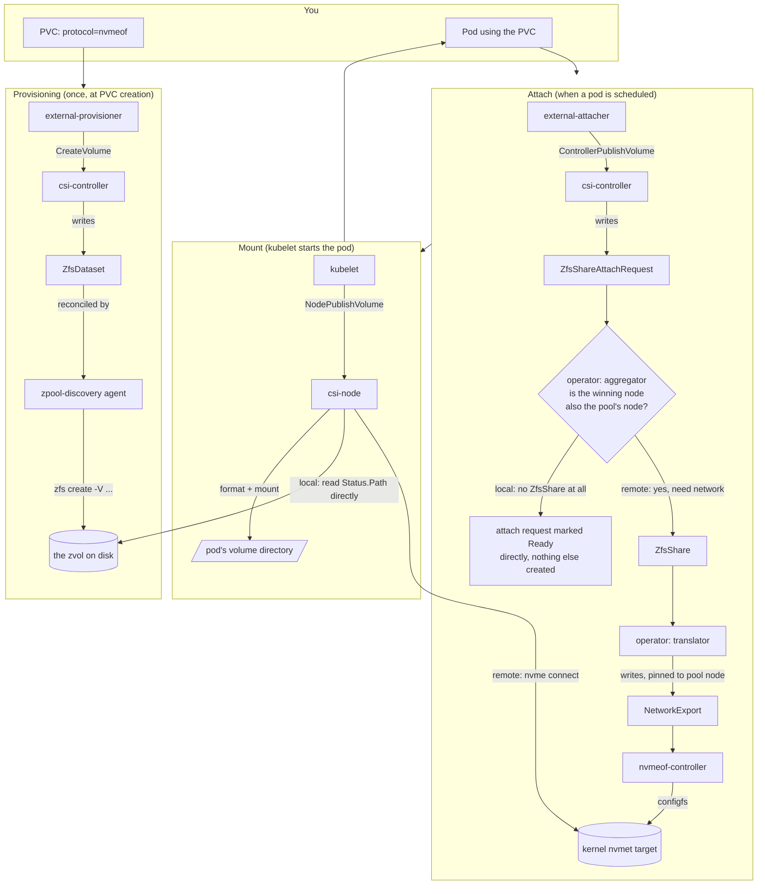
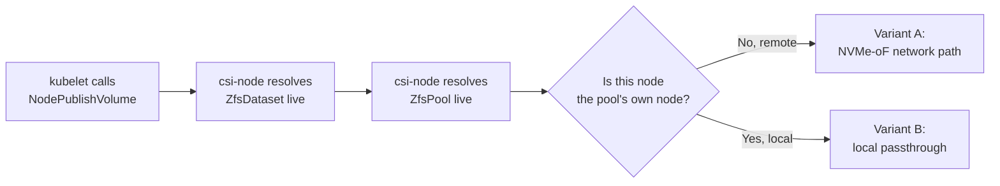

# From `kubectl apply` to a Mounted Volume: the Zvol PVC Story

This is a plain-language, end-to-end walkthrough of what actually happens when
someone creates a PVC backed by a **zvol** (a block-device volume, protocol
`nvmeof`) in this project, and later mounts it into a pod — covering both ways
that mount can happen: over the network (NVMe-oF) and, since ADR-0031,
directly on the machine that has the disk ("local passthrough").

It's written for someone who understands Kubernetes basics (Pods, PVCs, CSI
drivers exist) but has never read this codebase. Filesystem datasets (NFS)
follow a near-identical provisioning story with a different final mount step;
that's out of scope here.

---

## 1. The cast of characters

Nothing in this story is magic — it's about a dozen small programs and a
handful of Kubernetes objects passing a request along like a relay race. Here
is everyone involved, in the order you'll meet them:

| Who | What it actually is | Where it runs | Its job in this story |
|---|---|---|---|
| **`external-provisioner`** | Standard Kubernetes CSI sidecar (not our code) | In the `csi-controller` pod | Watches PVCs, calls `CreateVolume` |
| **`external-attacher`** | Standard CSI sidecar (not our code) | In the `csi-controller` pod | Watches `VolumeAttachment` objects, calls `ControllerPublishVolume` |
| **`csi-controller`** | This project's CSI Controller service | Deployment, one or few replicas, unprivileged | Turns CSI calls into `ZfsDataset` / `ZfsShareAttachRequest` objects |
| **`zpool-discovery`** ("the agent") | This project's per-node reconciler | DaemonSet, one pod per storage node | Discovers ZFS pools (`ZfsPool`), and does the actual `zfs create -V ...` for a `ZfsDataset` |
| **`operator`** | This project's cluster-wide reconciler | Deployment, leader-elected | Aggregates attach requests, decides whether a network export is even needed (ADR-0031), translates a `ZfsShare` into a node-pinned `NetworkExport` |
| **`nvmeof-controller`** | This project's NVMe-oF target reconciler | DaemonSet, one pod per storage node | Turns a `NetworkExport` into real kernel NVMe target (`nvmet`) configuration |
| **`csi-node`** | This project's CSI Node service | DaemonSet, one pod on **every** node | Does the actual mount kubelet asked for: `NodePublishVolume` etc. |
| **kubelet** | Standard Kubernetes node agent (not our code) | Every node | Calls `csi-node` right before starting the pod's containers |
| **`nvmet`** | A Linux kernel subsystem (not our code) | Storage node's kernel | The actual "NVMe-over-TCP server" that exposes a zvol on the network |

And the Kubernetes objects (CRDs) that carry the request between them:

| Object | Written by | Read by | Meaning |
|---|---|---|---|
| `ZfsDataset` | `csi-controller` | `zpool-discovery`, `csi-node` | "This zvol/dataset should exist, this big, on this pool" |
| `ZfsPool` | `zpool-discovery` | everyone | "This pool exists, lives on node X, at IP Y, health Z" |
| `ZfsShareAttachRequest` | `csi-controller` | `operator` | "Node X wants access to volume V" (one object per volume+node pair) |
| `ZfsShare` | `operator` (aggregator) — **only created when the attach actually needs the network** | `operator` (translator) | "Volume V should be exported to nodes {X, Y, ...}" (ref-counted) |
| `NetworkExport` | `operator` (translator) | `nvmeof-controller` / `nfs-controller`, `csi-node` | "Export volume V's data from pool-node P, over protocol Q" |

---

## 2. The big picture

Three phases, three different triggers:

1. **Provisioning** happens once, when the PVC is created — it just makes the
   zvol *exist*. Nothing is attached to anything yet.
2. **Attach** happens when a pod that uses the PVC is scheduled to a node —
   it's Kubernetes/CSI asking "is node X allowed to touch this volume?", and
   (new since ADR-0031) it's also where "does this even need a network
   export?" gets decided, *before* anything network-shaped is created.
3. **Mount** happens right before the pod's containers start — it's the actual
   "make the bytes appear inside the pod" step, and it's where the **local vs.
   remote** fork in the road happens on the node-plugin side.

---

## 3. Phase 1 — Provisioning: making the zvol exist

**Trigger:** you `kubectl apply` a PVC with a StorageClass that points at this
driver with `protocol: nvmeof`.

1. Kubernetes notices the PVC is unbound. The `external-provisioner` sidecar
   (living in the `csi-controller` pod) calls the CSI RPC **`CreateVolume`**.
2. `csi-controller`'s `CreateVolume`:
   - Works out the requested size, pool, and any other parameters.
   - Invents an opaque, internal dataset name (something like
     `csi-vol-<uuid>`) — deliberately *not* the PVC's own name, so a later
     rename of the PVC/PV never has to rename anything on disk.
   - Writes a **`ZfsDataset`** object describing the desired zvol: which pool,
     what name, how big.
   - Waits (polling, up to a timeout) for that object's `status.phase` to
     become `Ready`.
3. Meanwhile, on the storage node itself, **`zpool-discovery`** (the "agent")
   is watching `ZfsDataset` objects for its own pool. It notices the new one
   and:
   - Runs the real `zfs create -V <size> <pool>/<path>` command.
   - Computes the on-disk device path — for a zvol this is always
     `/dev/zvol/<pool>/<path>` — and writes it to `status.path`.
   - Sets `status.phase = Ready`.
4. `csi-controller` sees `Ready`, and returns success (with the volume id) to
   `external-provisioner`, which creates the `PersistentVolume`.
5. The PVC is now `Bound`. **Nothing has been attached or mounted anywhere.**
   The zvol just quietly exists on the storage node's pool, unused, until some
   pod actually wants it.

---

## 4. Phase 2 — Attach: "is this node allowed in, and does it even need the network?"

**Trigger:** a pod that uses the PVC gets scheduled to a node (call it node
**X**).

This phase exists because of a deliberate **zero-trust design** (ADR-0010):
the driver never exports a volume to the network at all unless *some* node has
actually asked for it. A freshly-provisioned, never-attached zvol has no
listener, no export, nothing to attack.

1. Kubernetes creates a `VolumeAttachment` object. The `external-attacher`
   sidecar sees it and calls **`ControllerPublishVolume(volumeId, nodeId=X)`**.
2. `csi-controller`:
   - Double-checks a zvol is never attached read-write to two nodes at once
     (it's always single-node/RWO — attaching it twice would corrupt it).
   - Writes a **`ZfsShareAttachRequest`** object: "node X wants volume V".
   - Waits for it to become `Ready`.
3. The **`operator`**'s aggregator (running once, cluster-wide, leader-elected)
   watches `ZfsShareAttachRequest` objects. For a zvol it resolves the single
   winning node (if more than one node raced to attach, the oldest request
   wins), then asks one more question: **is that winning node also the node
   that hosts the pool itself (`ZfsPool.status.currentNode`)?**
   - **If yes (local):** nothing further is created at all. No `ZfsShare`, no
     `NetworkExport`, no `nvmet` configuration, no per-attach authentication
     secret. The attach request is marked `Ready` immediately — there is
     nothing to wait for. A `ZfsShare`'s existence is meant to always mean
     "this is exported over the network," so when it isn't needed, it's
     simply never created (ADR-0031).
   - **If no (remote):** the aggregator creates one **`ZfsShare`** object
     listing the winning node as its consumer.
4. (Remote case only) The operator's **translator** watches `ZfsShare`
   objects, looks up which node currently hosts the pool
   (`ZfsPool.status.currentNode`), and writes a **`NetworkExport`** — the
   concrete instruction "export this data, from this node, over this
   protocol, to this allow-list".
5. (Remote case only) On the storage node, **`nvmeof-controller`** is
   watching for `NetworkExport` objects with `protocol: nvmeof`. When it sees
   the new one, it talks to the Linux kernel's NVMe target subsystem
   (`nvmet`) through `configfs`:
   - Creates an NVMe subsystem for this volume (if not already there).
   - Adds the zvol as a namespace inside it.
   - Enables the TCP listener port.
   - Generates the subsystem's NQN (its NVMe-oF address) and writes it back
     to `NetworkExport.status.nqn`.
6. (Remote case only) Once `nvmeof-controller` confirms the export is live,
   the `ZfsShareAttachRequest` becomes `Ready`, and `ControllerPublishVolume`
   finally returns success.

At the end of Phase 2: for a remote attach, the zvol is now reachable **over
the network** by the winning node — but still nothing is mounted inside the
pod yet. For a local attach, absolutely nothing network-shaped exists at all;
the only thing that's happened is a Kubernetes object (`ZfsShareAttachRequest`)
recording "node X is allowed to use this volume."

---

## 5. Phase 3 — Mount: the local/remote fork in the road

**Trigger:** kubelet is about to start the pod's containers and calls the CSI
Node service on node X.

This is where the two variants diverge on the node-plugin side (independently
of, but consistently with, the decision already made in Phase 2). Both start
identically:

`csi-node` never trusts anything cached from provisioning time — it looks up
the live `ZfsDataset` (for the pool GUID, dataset path, protocol) and the live
`ZfsPool` (for health and current node/IP) on **every single mount call**.
That's deliberate: a pool can move, a dataset can be renamed, and a stale
answer baked into the PV object at creation time would silently go wrong
later (ADR-0021/ADR-0022). It's also the same comparison the aggregator
already made in Phase 2 — computed independently here, live, rather than
trusted from that earlier decision.

### Variant A — Remote (pod's node ≠ the pool's node)

This is the original, always-available path — it works from any node in the
cluster, at the cost of a real network hop.

1. `csi-node` fetches the `NetworkExport` object for this volume and reads its
   NQN (the NVMe-oF "address" `nvmeof-controller` set up in Phase 2).
2. It builds a per-attach identity (a unique host NQN/ID, plus an optional
   DH-CHAP authentication secret — ADR-0011's zero-trust NVMe-oF auth) and
   runs `nvme connect` against the pool's IP, port 4420, with that NQN.
3. The Linux kernel's NVMe-oF **initiator** on node X opens a TCP connection
   to the storage node's **`nvmet`** target, negotiates, and a brand-new local
   block device appears on node X (e.g. `/dev/nvme3n1`) — that device is a
   window straight through to the zvol, wherever it physically lives.
4. `csi-node` formats that device (first time only) and mounts it at the
   pod's target path — or, for raw block volumes, bind-mounts the device node
   directly.
5. The pod starts and sees its volume, unaware that every read/write is now
   quietly going out over TCP to another machine (or, on a single-node
   cluster, out over TCP *to itself* — see
   [known-pitfalls.md](known-pitfalls.md) class 21 for why that's more
   expensive than it sounds).

### Variant B — Local (pod's node == the pool's node) — ADR-0031

This is the shortcut: if the pod landed on the very machine that has the
disk, none of the network machinery in step 1-3 above is needed at all — and,
per Phase 2, it was never even created in the first place.

1. `csi-node` already knows (from Phase 1) that the agent recorded the zvol's
   real device path in `ZfsDataset.status.path` — for a zvol this is always
   `/dev/zvol/<pool>/<dataset>`, the same device node the kernel maintains
   whether or not anything is exported over NVMe-oF.
2. `csi-node` uses that path **directly**. No `NetworkExport` lookup, no `nvme
   connect`, no DH-CHAP, no TCP loopback.
3. It formats (first time only) and mounts that device at the pod's target
   path, exactly like step 4 above — the mount/format code is identical
   either way, only the device path's origin differs.
4. The pod starts and sees its volume — every read/write goes straight to the
   kernel's ZFS/zvol driver, no network stack involved at all, and (per Phase
   2) nothing was ever configured in `nvmet` to begin with.

---

## 6. And in reverse: unmounting and detaching

The teardown mirrors provisioning/attach, just in the opposite order:

1. Pod is deleted → kubelet calls **`NodeUnpublishVolume`**: `csi-node`
   unmounts the target path, and (remote case only) runs `nvme disconnect`
   (a harmless no-op if nothing was ever connected).
2. `VolumeAttachment` is deleted → `external-attacher` calls
   **`ControllerUnpublishVolume`**: `csi-controller` deletes the
   `ZfsShareAttachRequest` for that node.
3. The operator's aggregator notices one fewer request. If it was the last
   one for that volume **and** a `ZfsShare` existed (i.e. it was a remote
   attach), it deletes the `ZfsShare`, which cascades to deleting the
   `NetworkExport`, which `nvmeof-controller` reconciles by tearing down the
   `nvmet` subsystem/namespace. For a local attach there was never a
   `ZfsShare` to delete. The zvol itself is untouched either way — only the
   *export* (if any) goes away.
4. If the PVC itself is deleted → `external-provisioner` calls
   **`DeleteVolume`**: `csi-controller` deletes the `ZfsDataset`, and
   `zpool-discovery`'s finalizer runs `zfs destroy` before letting the object
   actually disappear.

---

## 7. Every CSI call in this story, in one table

| RPC | Called by | Triggered when | What this driver does |
|---|---|---|---|
| `CreateVolume` | external-provisioner | PVC created | Writes `ZfsDataset`, waits for `Ready`, returns the volume id |
| `DeleteVolume` | external-provisioner | PVC deleted | Deletes `ZfsDataset`; agent's finalizer runs `zfs destroy` first |
| `ControllerPublishVolume` | external-attacher | Pod scheduled to a node | Writes `ZfsShareAttachRequest{volume,node}`, waits for either a local "Ready, no export needed" verdict or the full export chain (Phase 2) to go `Ready` |
| `ControllerUnpublishVolume` | external-attacher | Pod's volume no longer needed on that node | Deletes the `ZfsShareAttachRequest` |
| `ControllerExpandVolume` | external-resizer | PVC size increased | Bumps `ZfsDataset.spec`'s size, waits for the agent to grow the zvol; tells the CO a node-side step is still needed |
| `NodeGetInfo` | kubelet | Plugin registration | Returns this node's name |
| `NodeGetCapabilities` | kubelet | Plugin registration | Advertises volume-expansion support |
| `NodePublishVolume` | kubelet | Right before the pod's containers start | Resolves `ZfsDataset`/`ZfsPool` live, then **local**: mounts `Status.Path` directly, or **remote**: `nvme connect` + mount |
| `NodeUnpublishVolume` | kubelet | Pod's containers have stopped | Unmounts; remote case also `nvme disconnect`s (a no-op if never connected) |
| `NodeExpandVolume` | kubelet | After `ControllerExpandVolume`, if node work is needed | **local**: resizes the filesystem straight from `Status.Path`, no rescan; **remote**: rescans the NVMe-oF namespace first, then resizes |

There is deliberately **no `NodeStageVolume`/`NodeUnstageVolume`**: this
driver publishes directly in one step rather than a separate stage+publish,
since it doesn't need the "shared staging directory for multiple pods on one
node" behavior those RPCs exist for.

---

## 8. The one-sentence version

*A PVC first makes a zvol exist (Phase 1); scheduling a pod then asks
permission and — only if the consuming node turns out to be different from
the pool's own node — switches on a network export for it (Phase 2); and
finally, right before the pod starts, the node either reaches that export
over NVMe-oF because the disk is elsewhere, or — when the disk is right there
on the same machine — skips the network entirely and mounts it directly
(Phase 3), exactly matching the decision already made back in Phase 2.*
